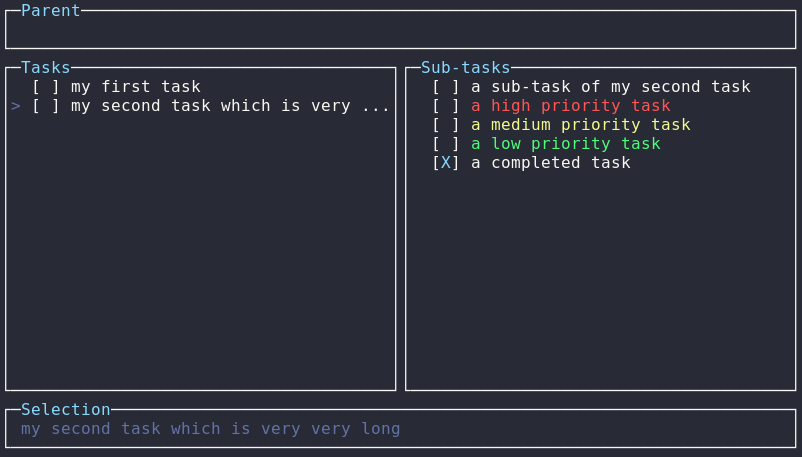

# *yat* -- yet another todo-list
>A simple terminal todo-list manager written in Rust. 

The terminal user interface (TUI) is built around the excellent [termion](https://crates.io/crates/termion) crate.

**Disclaimer**: this is a work in progress! When it reaches a usable state hopefully it will be published on crates.io.

## Installation
Requires an installation of [Rust](https://www.rust-lang.org/tools/install). Recommended build profile is release:
    
    $ curl https://sh.rustup.rs -sSf | sh
    $ git clone https://github.com/drvog/yat-rs 
    $ cd yat-rs
    $ cargo run --release

## Usage
Can be run with cargo from the root of the directory. Logging is provided by the nifty [fern](https://crates.io/crates/fern) and [log](https://crates.io/crates/log) crates; this will print to stderr, but these will be missed behind the TUI, so it might be useful to redirect them to a file:

    $ cargo run --release 2>err.log

Once running, **yat** uses the following key bindings:

|Key      | Command                     |
|---------|-----------------------------|
|a        | add new task                |
|e        | edit selected task          |
|d        | delete selected task        |
|u        | move selected task up       |
|n        | move selected task down     |
|w        | save todo list to file      |
|q        | quit                        |
|k, Up    | move selection up           |
|j, Down  | move selection down         |
|l, Enter | focus on selected sub-task  |
|h, b     | return focus to parent task |
|>        | increase task priority      |
|<        | decrease task priority      |

The user interface shows 4 panels: parent task, tasks, sub-tasks and selection. The tasks panel is the main panel, which allows you to navigate between tasks.

Moving the selection can be done with the UP and DOWN keys or alternatively with the vi(m) keys:

      k
      |
    h─.─l
      |
      j

The layout of the task on the panel is as follows:

    > [ ] todo
    │  │   │         
    │  │   └─ this is the content of the task (colour indicates priority).
    │  │
    │  └─ this shows task completion: [X] = completed, [ ] = not completed.
    │
    └─ this indicates that this task is currently selected.

Usually **yat** will save to $HOME/.todo/save.txt, which will be created the first time it runs. You can specify a custom file to load (or create) by passing it as a first argument on the command line. The formatting of the save file is as follows:

    [ ] ( ) todo
     │   │   │         
     │   │   └─ this is the content of the task.
     │   │
     │   └─ this shows task priority: ( ) = no priority, (C) = low priority,
     │      (B) = medium priority, (A) = high priority.
     │
     └─ this shows task completion: [X] = completed, [ ] = not completed. 

## To Do
1. Loading: although loading from a save file is implemented, the parsing functionality can be made more robust.
2. Configuration: user configuration e.g. custom colour scheme, keybindings etc.
3. Clean-up: general code clean-up and refactoring, including more extensive commenting.

## License

[MIT License](LICENSE)
